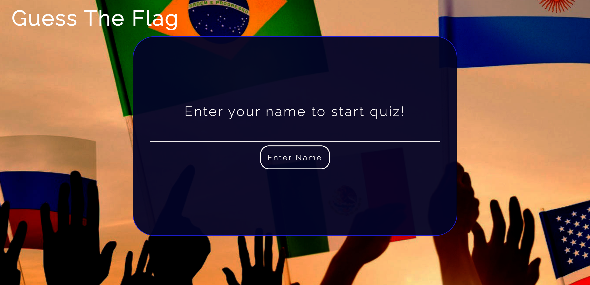

# Flag Quiz 

Flag quiz is a site that challenges peoples flag skills as well as teaches them what flag belongs to what countries in a fun way. The quiz has all 254 countries flags. Therefore, this is an advanced quiz. The website will be targeted by students who have to learn what country all flags belong to and those who are looking to challenge their flag skills.

The live link: https://frirsta.github.io/example-quiz/

---

## Features
---

### Existing Features

* Logo
  * On top of the page is the logo with the name of the Quiz.
  
* The landing page image
  * The landing includes text that allows the user to understand what type of quiz is on the website.
  * This section introduces the user to to the Flag Quiz with an image of flags from different countries being held my people to let the user know this is a "Flag" quiz before reading the text. Which will give the impression that they are on the website they are looking for, before reading the text saying its a world flag quiz.
  * There is also the text of the rules on the first page to allow the user to understand how the quiz works.
  * The landing page also has a button that sends the user to the name section of the page so they can start the quiz.
  

* Name section 
  * In this part of the website the user will write their name for it to be displayed after the quiz.
  * When the name is written and the user clicks the button the actual quiz will start.
  

* Quiz section
  * Question count. On top of the page is a question count, this allows the user to see how far they have gotten in the quiz and when it ends.
  * The quiz question is displayed during the whole quiz.
  * The flag that the user has to guess which country it belongs to is displayed under the question.
  * Under the flag there is an input area and a submit button. This is where the user will write their answer and submit it. 
  
* Summary section 
  * Name display
  * In this section the amount of correct and incorrect points will be displayed, to let the user know how the quiz went.
  * Under the result score is a play again button, which lets the user play the quiz again.
  * Under the play again button is a home button, which lets the user return to the home page.

  

### Features Left to Implement 

## Technologies used
---
  * HTML
  * CSS
  * JavaScript 
  * GitHub 
  * GitPod

## Testing 
---
* HTML
  * No errors were found when tested with [W3C validator](https://validator.w3.org/)

https://validator.w3.org/
https://jigsaw.w3.org/css-validator/

* CSS
  * No errors were found when tested with [jigsaw validator](https://jigsaw.w3.org/css-validator/)

    

        

    

    

* JavaScript
  * No errors were found.

https://jshint.com/

### Responsive tests

The responsive tests were by https://www.responsivedesignchecker.com/ and no errors were found.

### Lighthouse
The website has also been tested with the Chrome developer tool Google Lighthouse. It has been tested for desktop and for mobile. What was tested:
*  Performance
*  Accessibility
*  Best Practices
*  SEO (Search engine optimisation)

You can learn more about [DevTool](https://developer.chrome.com/docs/devtools/)

## Design
---
### wireframes

## Deployment
---
* This website was deployed by GitHub pages. The instructions to deploy are:
  * From the GitHub repository, you go to the settings tab.
  
  * Under the code and automation category you click on pages. 
  
  * From the branch drop-down menu, select Main or Master Branch and click on the save button to the right of the drop-down menu.

  * After a few minutes, refresh the page and a link will appear on top of the page area and this is the link to the website.
  

## Credits
---

### Content

* [w3resource](https://www.w3resource.com/javascript/form/all-letters-field.php)
  * I used this website to find out how to only look for letters in JavaScripy. 

### Media

* The flag images are links from https://flagpedia.net/
* The background image is from [RawPixel](https://www.rawpixel.com/image/654277/free-image-rawpixel)
  * Image by rawpixel.com
* The globe favicon is from [favicon](https://icons8.com/icon/63766/globe")
  * The icons8 is by [icon](https://icons8.com)  
* [FontAwesome](https://fontawesome.com/)
  * Icons from fontawesome.

